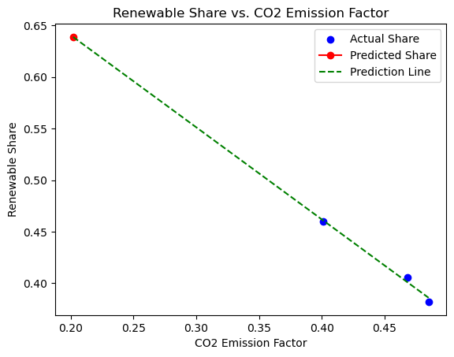

## Description
This analysis compares the levelized cost of hydrogen production of the steam methane reforming and water electrolysis process. For this purpose, Germany’s national strategy for producing hydrogen via electrolysis capacity of 5 GW by 2030 is modeled on Python.

## Tasks
- Quantifying the economic viability of hydrogen production methods: Modeled and simulated the levelized cost of hydrogen (LCOH) using Python, comparing steam methane reforming and water electrolysis to identify the most cost-effective option.
- Analyzing the impact of renewables on hydrogen production: Determined the share of renewables in the electricity generation mix, via linear regression, and assessed its influence on the environmental footprint of hydrogen production.
- Evaluating carbon pricing strategies for clean hydrogen: Calculated carbon dioxide emissions associated with different production methods and proposed a carbon price that incentivizes the use of renewable energy sources for hydrogen generation.

## Key Findings

### Specific Investment Cost (SIC):

Electrolysis has a significantly higher SIC (1000 €/kW) compared to steam-methane reforming (530 €/kW). This suggests that the initial capital investment required for electrolysis is substantially greater.

### Levelized Cost of Hydrogen (LCOH):

Electrolysis also has a higher LCOH (30 cent€/kWh) than steam-methane reforming (7.5 cent€/kWh). This indicates that the overall cost of producing hydrogen over its lifetime is significantly lower for steam-methane reforming.

### CO₂ Emissions:

Electrolysis produces significantly lower CO₂ emissions (11.5 Mn tCO₂e) compared to steam-methane reforming (5.8 Mn tCO₂). This makes electrolysis a more environmentally friendly option.

## Implications:

### Cost vs. Environmental Impact:
The choice between these two methods involves a trade-off between cost and environmental impact. Steam-methane reforming offers a lower cost but has higher emissions, while electrolysis has higher costs but lower emissions.

### Technological Advancements: 
As technology advances, the costs and efficiencies of both methods may change. Future developments could potentially reduce the cost gap between electrolysis and steam-methane reforming.

### Policy and Market Factors: 
Government policies, market demand, and the availability of renewable energy sources can also influence the choice between these methods. For example, incentives for renewable energy can make electrolysis more economically attractive.

Conclusion:

While steam-methane reforming currently offers a more cost-effective option, the environmental benefits of electrolysis make it a promising alternative, especially as renewable energy sources become more accessible and affordable. The future of hydrogen production will likely involve a mix of both methods, with the optimal choice depending on specific factors such as location, energy costs, and environmental regulations.
